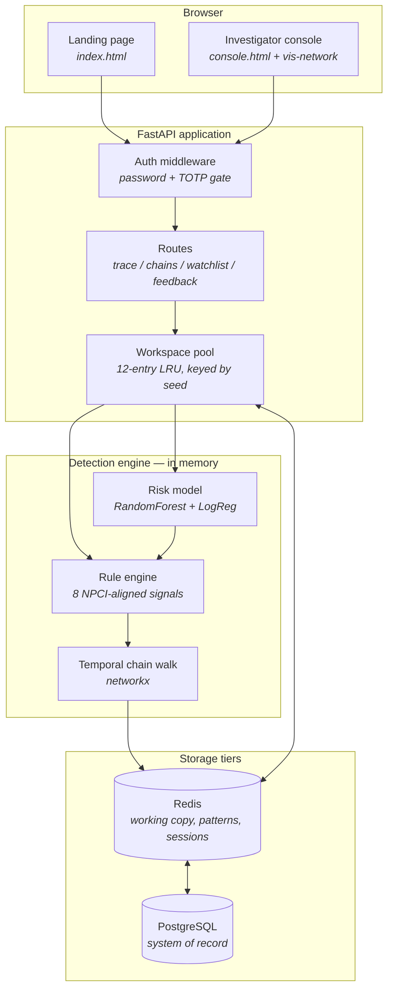

# MuleTrace

**Mule-account transaction chain detection for UPI / NPCI.**

*Transaction chain intelligence for the interbank rail.*

---

## The idea in one line

When a UPI fraud victim's money enters the network it doesn't stop at one account — it hops through a chain of mule accounts within minutes. MuleTrace models transactions as a time-stamped directed graph, walks the chain forward hop by hop from a flagged transaction, and names the **end node**: the account still holding the money, so it can be frozen before cash-out.

> Existing tools tell you an account *looks* suspicious. MuleTrace tells you which account *still has the money*.

---

## Table of contents

- [The problem](#the-problem)
- [Architecture](#architecture)
- [The detection pipeline](#the-detection-pipeline)
- [Tech stack](#tech-stack)
- [Running it locally](#running-it-locally)
- [Configuration](#configuration)
- [Access control](#access-control)
- [API](#api)
- [A different dataset for every session](#a-different-dataset-for-every-session)
- [Results](#results)
- [Tests](#tests)
- [Deployment](#deployment)
- [Repository layout](#repository-layout)
- [Honest scope](#honest-scope)

---

## The problem

A victim reports a UPI fraud. By the time the complaint reaches a bank, the money has already moved: into one mule account, out within minutes, into a second, a third, a fourth. The median chain in the reference dataset completes in **151 minutes**.

Freezing the account the victim named accomplishes nothing — it is empty. The account worth freezing is several hops downstream, and nobody has named it.

Two distinct questions follow, and MuleTrace answers both:

1. **Reactive** — given a flagged transaction, where is the money *now*?
2. **Proactive** — which chains are running right now that nobody has complained about yet?

---

## Architecture

Three tiers, each degrading independently downward. No Redis means read from Postgres every time; no Postgres means generate in memory. Neither absence stops the app, and `/api/health` reports which tiers are actually live rather than pretending.



**Read the data path bottom-up.** PostgreSQL is the durable system of record — every dataset (accounts, transactions, labelled chains) is written there and can be queried with SQL by anyone auditing a case. In a real deployment this is where a bank's own warehouse plugs in. Redis holds a serialised working copy plus the detection output, so a revisited dataset costs a deserialise instead of a SQL round trip. The graph and fitted model live in-process, because a chain walk over a `networkx` object cannot be done from a stateless function.

Measured on a 12,275-transaction dataset:

| Path | Cost |
|---|---|
| Cold — generate, persist, build | 1.63 s |
| Warm — Redis working copy | 1.03 s |
| Redis cleared — read from PostgreSQL | 1.23 s |

---

## The detection pipeline

The order matters. Each stage narrows what the next one has to consider.

### 1. Rule engine — decide who is worth watching

**Not every account gets traced.** Monitoring everything is how detection systems become unusable, so a rule engine runs first and scores each account against **its own behavioural baseline** — not a network-wide threshold. Eight signals, aligned to the risk factors NPCI actually names:

| Rule | Fires when |
|---|---|
| `LARGE_FLOW` | Inflow far outside this account's own normal range |
| `HIGH_VELOCITY` | In/out transaction counts spike against its baseline |
| `DEBIT_CREDIT_SHIFT` | The debit/credit balance deviates from its own history |
| `NEW_COUNTERPARTIES` | Sudden burst of never-seen payers or payees |
| `PASS_THROUGH` | Money arrives and leaves almost intact, almost immediately |
| `DORMANT_WAKE` | A long-quiet account reactivates into high value |
| `THIN_HISTORY` | Little history behind material amounts |
| `MULE_SCORE` | The classifier's own probability |

Only accounts clearing `MONITOR_THRESHOLD` seed a trace, and a transaction is scanned if **either** endpoint is monitored — sender *or* beneficiary, because a mule is both in turn.

The observation window is tunable via `MULETRACE_RULE_WINDOW_HOURS`, and the trade-off is real:

| Window | Monitored | Of network | Chains | Recall | Precision |
|---|---|---|---|---|---|
| 48 h | 76 | 6.6% | 31 | 36.4% | 80.6% |
| **168 h** | **318** | **27.4%** | **80** | **86.4%** | **73.8%** |
| 336 h | 536 | 46.2% | 87 | 93.9% | 73.6% |
| 720 h | 462 | 39.8% | 86 | 95.5% | 75.6% |

168 hours is the default: a quarter of the network under watch, most chains caught. Widening past 336 h buys little recall for a lot more monitoring.

### 2. Temporal chain walk — follow the money

Accounts are nodes; transactions are directed edges carrying `(amount, timestamp, mode)`. From a flagged transaction the walk moves **forward in time**, following money rather than relationships. A hop is admitted only if:

- it happens **after** the money arrived (causal ordering — the single most important rule)
- it falls inside a **48-hour** window
- it moves **70–125%** of what came in

That upper bound matters more than it looks. Without it the walk hops onto the account's own unrelated, larger transfers and wanders off the money trail — the console once reported "20699% forwarded". Adding the ceiling took scan precision from 94.9% to 97.4%.

The walk also handles **splitting** (if no single hop qualifies, everything leaving inside the window is aggregated, so smurfing into five transfers doesn't duck the threshold), **cycles**, a hop cap, and terminates at **cash-out** (ATM / untraceable merchant). Wherever it stops is the end node.

`hop_count` counts transfers, so it always equals `len(path) - 1`.

### 3. Risk model — rank probable mules

A Random Forest over **19 explainable per-account features** (turnaround speed, forward ratio, fan-in/fan-out, amount behaviour, account age, KYC tier, activity density), with a Logistic Regression baseline reported alongside for honesty. Kept small and explainable on purpose: a bank has to be able to read *why* an account was flagged, so `/api/risk-score/{id}` returns per-feature percentiles, not just a number.

### 4. Feedback loop — the only non-synthetic labels

Closed cases are the sole route to real supervision, so they are captured as first-class data. `POST /api/feedback` writes an **append-only** JSON Lines log — append-only because a freeze decision is an audit trail: a verdict is superseded by a later entry, never edited in place.

Labels are **not** applied to the live scorer. A model that shifted under an investigator mid-review would make the queue untrustworthy; they are staged for the next deliberate retrain.

---

## Tech stack

| Layer | Choice | Why |
|---|---|---|
| **API** | FastAPI + Uvicorn (Python 3.12) | Async, typed, automatic validation on walk parameters |
| **Graph** | networkx | Temporal directed multigraph; the walk itself is custom |
| **ML** | scikit-learn (RandomForest, LogisticRegression) | Explainable feature importances over a black box |
| **Data** | pandas, NumPy | Feature engineering, dataset generation |
| **System of record** | PostgreSQL 18 (`psycopg` 3) | SQL-auditable case data; `COPY` for bulk writes |
| **Working copy** | Redis 7 (`redis-py`) | ZSET for ranked chains, HASH for account scores, TTL'd sessions |
| **Frontend** | Vanilla JS, vis-network, canvas | No build step; one static directory deploys anywhere |
| **Auth** | TOTP (RFC 6238) on stdlib HMAC, scrypt hashing | No external IdP, no extra dependency |
| **Hosting** | Render (backend) + Netlify (landing) | The app holds live objects in memory; it needs a process, not a function |
| **Tests** | pytest, httpx | 123 tests |

---

## Running it locally

**Prerequisites:** Python 3.12+. PostgreSQL and Redis are both optional — the app runs without either.

**1. Install**

```bash
python -m venv .venv
```

```bash
.venv/Scripts/python.exe -m pip install -r requirements.txt
```

**2. Run**

```bash
.venv/Scripts/python.exe -m uvicorn app:app --app-dir backend --port 8000
```

**3. Open**

- Landing page — <http://localhost:8000>
- Investigator console — <http://localhost:8000/console>

The console is behind password + TOTP by default. For a rehearsal, run it open:

```bash
MULETRACE_AUTH=off .venv/Scripts/python.exe -m uvicorn app:app --app-dir backend --port 8000
```

**4. Reproduce the numbers**

```bash
.venv/Scripts/python.exe backend/evaluate.py --seed 26
```

### Optional: PostgreSQL

Install on Windows from an **elevated** terminal:

```powershell
winget install --id PostgreSQL.PostgreSQL.17 --accept-package-agreements --accept-source-agreements
```

Copy `.env.example` to `.env` and set `MULETRACE_POSTGRES_URL`. The application database is created on first use. `GET /api/datasets` lists what Postgres is holding.

### Optional: Redis

On Windows, Memurai is Redis-compatible and installs from an **elevated** terminal (the MSI's custom actions fail without elevation):

```powershell
winget install --id Memurai.MemuraiDeveloper --accept-package-agreements --accept-source-agreements
```

Alternatives: `docker run -d -p 6379:6379 redis:7-alpine`, or point `MULETRACE_REDIS_URL` at a managed instance. Verify with:

```bash
.venv/Scripts/python.exe scripts/check_redis.py
```

> **Windows note.** Some examples chain commands with `&&`, which Git Bash accepts but **Windows PowerShell 5.1 rejects** with `The token '&&' is not a valid statement separator`. In PowerShell, run the parts on separate lines, or use the full interpreter path in a single command.

---

## Configuration

Read from the environment, or from a gitignored `.env` (see `.env.example`). Environment variables always win.

| Variable | Default | Purpose |
|---|---|---|
| `MULETRACE_POSTGRES_URL` | *unset* | System of record. Unset means generate in memory |
| `MULETRACE_POSTGRES_ADMIN_URL` | *unset* | Only needed to `CREATE DATABASE` on first run |
| `MULETRACE_REDIS_URL` | `redis://127.0.0.1:6379/0` | Working copy. Unreachable means in-process fallback |
| `MULETRACE_AUTH` | `on` | `off` disables the gate entirely |
| `MULETRACE_USER` / `_PASSWORD` / `_TOTP_SECRET` | *generated* | Pin the account so an ephemeral host recreates it identically |
| `MULETRACE_RULE_WINDOW_HOURS` | `168` | How much of the feed counts as "now" |
| `MULETRACE_MAX_TXNS` | `22000` | Cap dataset size on a small host |
| `MULETRACE_FOREST_TREES` | `300` | Fewer trees for constrained CPU |

**No credential is defaulted in source.** An unset Postgres URL disables the tier rather than falling back to a guessable local one.

---

## Access control

The console carries case data — victim VPAs, account ages, freeze recommendations — so it enforces password + TOTP multi-factor sign-in through **one middleware** in front of every data route, rather than per-route checks that can be forgotten.

`/login` walks two steps. The first factor only issues a **180-second challenge**; only the second mints a session. Challenges are single-use, failed attempts throttle at five per five minutes, and the enrolment secret is returned exactly once.

Passwords are **scrypt** with a per-user salt. TOTP is implemented on the standard library rather than adding a dependency. There is no external identity provider — any authenticator app works.

Accounts persist to `data/users.json` (gitignored), because a TOTP secret that regenerated on every restart would mean re-enrolling your phone each boot. Only sessions, challenges and the failure counter are ephemeral.

**Enrolment:**

```bash
.venv/Scripts/python.exe scripts/otp.py --enrol
```

Other flags: `--new-secret` (generate one for a deployment), `--reset-enrolment` (re-arm the QR), `--watch` (print the live code — a local convenience, not for a real deployment, since anyone who can run it can sign in).

---

## API

| Endpoint | Purpose |
|---|---|
| `GET /api/trace/{txn_id}` | Walk one flagged transaction to its end node. Accepts `min_forward_pct`, `max_gap_hours`, `max_hops` |
| `GET /api/chains` | Ranked active chains from the proactive scan |
| `GET /api/risk-score/{account_id}` | Mule probability plus the per-feature percentiles behind it |
| `GET /api/watchlist` | Accounts the classifier flags, highest score first |
| `GET /api/rules` and `/api/rules/{account}` | Rule-engine alerts, and what fired for one account |
| `GET /api/overview` | Dashboard totals and the model report |
| `GET /api/search` | Find transactions or accounts |
| `POST` and `GET /api/feedback` | Record and read investigator verdicts |
| `GET /api/feedback/labels` | Supervision accumulated for the next retrain |
| `POST /api/rescan` | Re-run the proactive scan |
| `POST /api/reload` | Issue a fresh session and a new dataset |
| `GET /api/evaluation` | Validation figures recomputed for the caller's dataset |
| `GET /api/datasets` | What PostgreSQL is holding |
| `GET /api/health` | Liveness, store and database tiers, auth state |

Every endpoint resolves the caller's workspace from the `mt_session` cookie. Append `?seed=<int>` to pin a specific dataset.

`/api/health` is deliberately **cheap** — it builds nothing. It used to construct a full workspace per probe, which cost ~2.5 s and got the first deploy killed for timing out. A test now guards the property.

---

## A different dataset for every session

Nothing on the site is hardcoded, and no two visitors see the same network. Each session gets a seed; the seed builds its own synthetic dataset; every figure derives from it.

| Session | Transactions | Accounts | Chains detected | Fraud chains | Recoverable |
|---|---|---|---|---|---|
| DS-15001 | 15,427 | 1,146 | 74 | 51 | ₹47.31 L |
| DS-10151 | 18,535 | 1,398 | 57 | 37 | ₹21.91 L |
| DS-69869 | 14,114 | 1,410 | 74 | 63 | ₹41.75 L |
| DS-74197 | 10,968 | 1,105 | 84 | 66 | ₹44.42 L |
| DS-94544 | 15,869 | 1,303 | 79 | 56 | ₹36.76 L |

Scale varies with the seed, not just contents — otherwise every dashboard would show roughly the same totals and read as canned.

**Every page load hands out a new dataset.** The session cookie then keeps it fixed for all subsequent API calls, so tracing, dismissing and rescanning never shift the data underneath you — only a reload moves to new data. Pin one with `?seed=26` when the numbers need to match a slide.

Dashboard counts and the chain table both come from one `visible_chains()` definition, so they cannot drift apart: dismissing a chain decrements the stat card and removes the row in the same step.

---

## Results

Measured by `backend/evaluate.py` against 45 injected chains with known ground truth (`--seed 26`). The served app scales dataset size per seed, so the console's own figures differ — both are honest, they are simply different networks.

**Chain walk** — given a flagged transaction, find the account still holding the money:

| Metric | Value |
|---|---|
| End-node accuracy | **100%** |
| Full-path recovery | **100%** |
| Mean hop recall | **100%** |

Read that with the sensitivity sweep, not on its own. These chains were generated to the same temporal logic the walk looks for, so the headline is close to circular. What the sweep shows is that the defaults sit on a genuine plateau, and that the rule degrades in **both** directions:

| Walk setting | End-node accuracy |
|---|---|
| strict (85% forwarded, 6 h) | 8.9% |
| tight (80%, 24 h) | 37.8% |
| **default (70%, 48 h)** | **100%** |
| loose (60%, 96 h) | 100% |
| very loose (40%, 168 h) | 88.9% |

Over-tightening misses real hops. Over-loosening is the more interesting failure: the walk admits unrelated transfers and wanders off the trail.

**Proactive scan** — surface chains with no complaint filed:

| Metric | Value |
|---|---|
| Recall vs. injected chains | **100%** |
| Precision @ 10 / @ 20 / @ 30 | **100% / 100% / 100%** |
| Precision over the whole surfaced set | 75.8% |
| Clean prefix | 47 chains |

The gap between those rows is the point. All 45 real chains rank above every false positive, so an investigator working the queue top-down clears every genuine chain before meeting a single false alarm. The 75.8% counts the tail nobody needs to work.

**Mule classifier:**

| Metric | Random Forest | Logistic baseline |
|---|---|---|
| ROC AUC | **0.918** | 0.853 |
| Average precision | **0.766** | — |
| Precision / Recall / F1 | 0.667 / 0.633 / 0.650 | 0.453 / 0.717 / 0.555 |

**These are deliberately not perfect.** An earlier generator opened every mule account fresh, so `account_age_days` separated the classes outright and every metric read 1.0 — an artifact, not a result. Mules are now recruited the way real rings recruit: **35% freshly opened, 50% existing accounts turned, 15% dormant accounts reactivated**, so most arrive with an ordinary age and a real history. Legitimate high-value P2P was widened to overlap the fraud amount range for the same reason. Account age fell from the top feature (0.233) to fifth (0.086).

*A model that scores 1.0 on your own data is a model you haven't tested yet.*

**What transfers and what does not:** the chain walk is deterministic and rule-based, and transfers directly. The classifier is a *ranking aid* trained on synthetic behaviour — it would need retraining on NPCI's real graph, which is exactly what the feedback loop accumulates labels for.

---

## Tests

```bash
.venv/Scripts/python.exe -m pytest
```

**123 tests.**

| Suite | Covers |
|---|---|
| `test_chain_walk.py` | One test per hop-admission rule on hand-built graphs — causal ordering, time window, forward floor **and ceiling**, split detection, cycle and hop guards, cash-out termination |
| `test_api.py` | Endpoint contracts, feedback loop, that dashboard counts can never disagree with the table, seed reproducibility, and that `/api/health` stays cheap |
| `test_auth.py` | Challenge/session split, single-use challenges, throttling, TOTP windows |
| `test_rules.py` | Each rule against its own baseline |
| `test_store.py` | The same assertions against both Redis and the in-process fallback |
| `test_db.py` | Round-trip fidelity — dtypes and UTC timestamps must survive PostgreSQL |

The walk tests exist because these are the decisions a bank would have to justify. Two real off-by-one bugs were caught here: `hop_count` computed as `len(hops) - 1` silently discarded every 3-mule chain from the proactive scan, and an inclusive `max_hops` bound returned 5 hops for a cap of 4.

---

## Deployment

**Backend on Render** (`render.yaml`). The app needs a real process, not a serverless function: it holds a `networkx` graph and a fitted model in an in-process LRU pool.

**Frontend on Netlify** (`netlify.toml`). Static landing page only; `/console` and `/login` redirect to the backend, which serves both the page and the API from one origin so the session cookie works.

Full instructions, including the Render free-tier region gotcha, are in [DEPLOY.md](DEPLOY.md).

---

## Repository layout

```
backend/
  app.py             FastAPI: routes, auth middleware, session cookies
  auth.py            scrypt passwords, TOTP, challenge/session split
  config.py          .env loading; environment always wins
  db.py              PostgreSQL system of record (COPY-based writes)
  store.py           Redis wrapper + in-process fallback
  workspace.py       per-session datasets, LRU pool, Postgres -> Redis -> graph
  generate_data.py   synthetic UPI network + injected chains (seeded)
  graph_engine.py    temporal graph, chain walk, proactive scan
  rules.py           8-signal rule engine over per-account baselines
  risk_model.py      19 features + RandomForest / LogisticRegression
  feedback.py        append-only investigator verdict log
  evaluate.py        validation + sensitivity sweep
frontend/
  index.html         landing page
  console.html       investigator console
  app.js             console logic, vis-network graph
  globe.js           procedural canvas backdrop (no stock imagery)
  styles.css         design tokens + console
  landing.css        landing page
scripts/
  otp.py             enrolment, secret generation, live codes
  check_redis.py     exercises exactly the operations the app issues
  build_metrics.py   regenerates frontend/metrics.json
tests/               123 tests
docs/                pitch and technical brief
```

---

## Honest scope

The demo runs on **synthetic data**. Real UPI transaction data isn't accessible outside NPCI and the banks, so these figures show the logic works as specified — not what it would score in production.

Cash-out (ATM, untraceable merchant, crypto off-ramp) is a dead end for tracing: the end node can be named, but funds already withdrawn cannot be recovered by a freeze.

**Any real deployment needs a human reviewer before a freeze.** A wrong freeze on a genuine account is a serious harm, and nothing here should be wired directly to an automated freeze action.

---

## Docs

- [Full pitch](docs/pitch.md) — problem, architecture, workflow, AI integration, limitations, scalability, impact.
- [Technical brief](docs/technical-brief.md) — data model, detection logic, positioning vs. MuleHunter.AI.
- [Deployment guide](DEPLOY.md) — Render and Netlify, environment variables, free-tier caveats.
